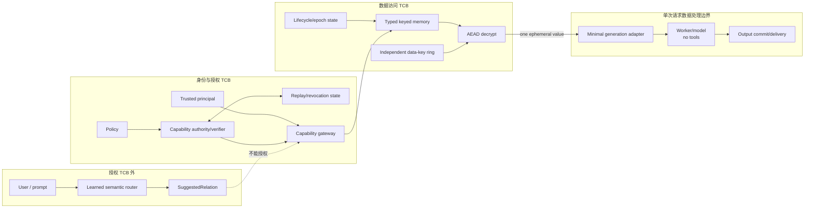

# TCB 架构与数据流

图源文件：[tcb_architecture.mmd](tcb_architecture.mmd)



## 1. 关键边界

### Authorization TCB

负责判断“是否允许访问”：

- principal authentication；
- policy/scope；
- capability integrity；
- expiry/revocation/replay；
- atomic single-use consumption；
- lifecycle/epoch。

学习型 router 不在该边界内。

### Data-access TCB

负责“只访问被授权的精确 record”：

- typed `(entity_id, RelationId)` lookup；
- 独立 data-key ring；
- AEAD metadata binding；
- record version floor；
- epoch-bound internal ticket。

### Per-request confidentiality boundary

plaintext 释放之后：

- generation adapter 只传递当前单个 value；
- worker 没有 gateway、memory、capability 或 key 工具；
- context 不跨请求复用；
- output 必须校验并显式 commit；
- 失败不恢复 capability。

worker 不参与授权决策，但收到 plaintext 后属于该请求的保密处理边界。

### Observability boundary

安全投影发生在日志/指标/tracing backend 之前：

```text
raw internal event
→ field/value allowlist
→ fixed low-cardinality projection
→ observability backend
```

plaintext、token、key、credential、subject/entity 标识不得成为 metric label 或
trace attribute。

## 2. 材料分布

| 组件 | Capability key | Release-ticket key | Data key | Plaintext |
|---|---:|---:|---:|---:|
| Capability authority/verifier | 是 | 否 | 否 | 否 |
| Gateway | 是 | 是 | 否 | 仅最终响应路径 |
| Memory | 否 | 是 | 是 | decrypt 后短暂存在 |
| Generation adapter/worker | 否 | 否 | 否 | 当前请求的单个 value |
| Observability backend | 否 | 否 | 否 | 否 |
| 正式 artifacts | 否 | 否 | 否 | 否 |

父测试进程在原型装配时持有全部 key；该事实是当前 TCB 限制，不是生产密钥隔离。

## 3. 请求与生命周期状态

```text
identity_verified
→ capability_consumed
→ release_ticket_issued
→ record_looked_up
→ record_decrypted
→ generator_invoked
→ output_committed
→ response_delivered
```

论文统一使用 D2.3 的五个可审计 milestone：

```text
capability_consumed
record_decrypted
generator_invoked
output_committed
response_delivered
```

lookup 和内部 ticket issuance 是实现步骤，不改变“消费先于 plaintext release”的
核心状态机。

## 4. Router 的唯一合法角色

Router 可以：

- 建议 relation；
- 提示用户确认显式作用域；
- 改善交互与表单填写。

Router 不可以：

- 创建 `AuthenticatedPrincipal`；
- 签发或验证 capability；
- 选择 memory bucket 并授权访问；
- 修改 subject/entity/relation/permission scope；
- 访问 replay state、data key 或 ciphertext；
- 在授权失败后调用 generator 处理 plaintext。

## 5. 未实现的生产边界

图中的 external IAM/KMS/trusted counter 是未来工程依赖，不是当前实现：

- 真实 IdP/session binding；
- capability signing key 与 verifier 的隔离；
- data key 的 KMS/HSM 托管；
- 同主机之外的 monotonic epoch；
- mTLS/service identity；
- distributed transaction/replay state；
- third-party observability policy。

因此该架构图描述的是研究原型的信任分解，而不是生产部署拓扑。
